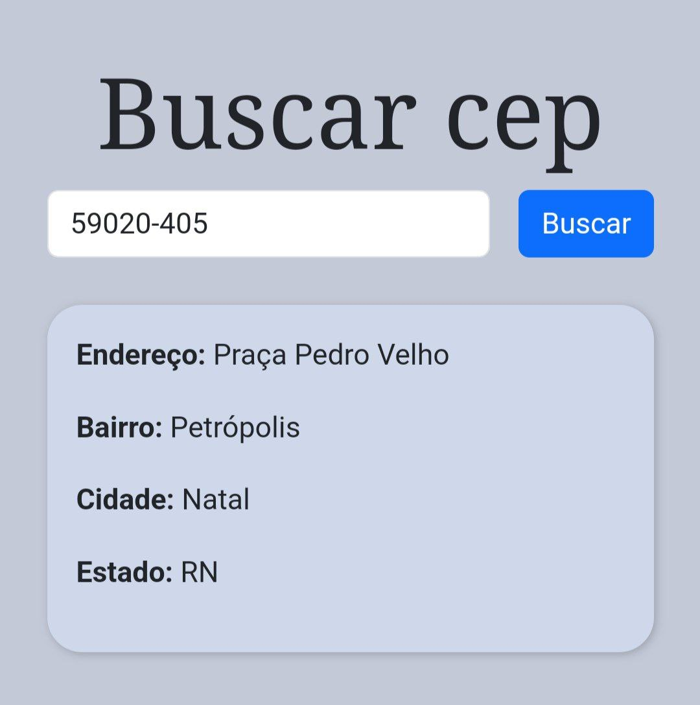

# Busca via CEP
Uma simples página para busca de informações de endereço com base no CEP utilizando a API do [ViaCEP](https://viacep.com.br/).

## 🚀 Funcionalidades

- Permite buscar informações de endereço a partir de um CEP válido.
- Adiciona máscara automaticamente ao campo de entrada de CEP.
- Exibe os resultados formatados diretamente na página.
- Notifica o usuário caso o CEP digitado seja inválido ou não encontrado.

## 🛠️ Tecnologias Utilizadas

- **HTML5**: Estrutura do projeto.
- **CSS3**: Estilos personalizados e uso do Bootstrap 5 para estilização.
- **JavaScript**: Lógica de aplicação, integração com a API ViaCEP e manipulação do DOM.
- **API ViaCEP**: Para buscar informações de endereço.

## 🖥️ Como Executar o Projeto

### 1. Acesse a página online:
O projeto está disponível no GitHub Pages. Clique no link abaixo para acessá-lo diretamente no navegador:  
[**Busca via CEP - GitHub Pages**](https://cmoiss.github.io/busca-via-cep/)

### 2. Execute localmente (opcional):
Caso prefira, você pode executar o projeto localmente seguindo os passos abaixo:

1. **Clone o repositório:**
   ```bash
   git clone https://github.com/cmoiss/busca-via-cep.git
   ```

2. Acesse o diretório do projeto:
    ```
    cd busca-via-cep
    ```


3. Abra o arquivo index.html em um navegador.

## 📸 Capturas de Tela
### Tela Inicial


### Resultado da Busca


## 🧑‍💻 Autor
Desenvolvido por [Caio Souza](https://github.com/cmoiss).
Fique à vontade para entrar em contato ou contribuir com o projeto!

